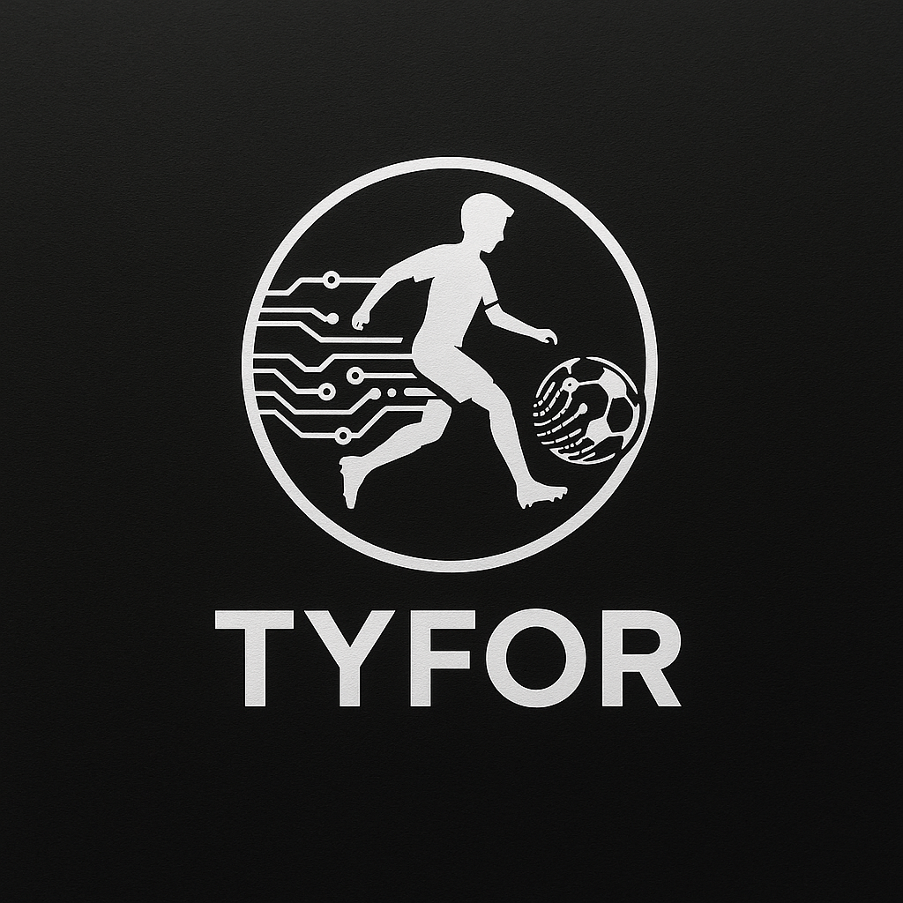

# TYFOR

## Project Overview
TYFOR is a data-driven scouting and performance analysis platform designed to support young football players' development and help clubs make informed transfer decisions. This project, developed as a **Senior Design Project**, focuses on leveraging advanced data analytics and machine learning to enhance talent identification, match analysis, and financial sustainability for Anatolian football clubs.

The platform aims to minimize reliance on player agents, optimize scouting operations, and provide a systematic approach to youth talent development, ultimately contributing to the long-term sustainability of football clubs.

## Main Components
IQAnadoluScout consists of **six** integrated modules:

### 1. Young Talent Development Module
This module enables clubs to **track and monitor** young players' training sessions and match performances. It provides:
- **Physical, endurance, and conditional performance metrics**
- **Graphical performance reports** to evaluate progress
- **Customizable training session analysis**

### 2. Scouting Network
The **scouting module** focuses on uncovering promising talents from **TFF 1st League and Polish leagues** by analyzing performance metrics. Key features include:
- **Position-based player recommendations** using advanced statistical models
- **Data-driven insights** for early talent discovery
- **Transfer potential assessment**

### 3. Match Analysis Module
Clubs can **input match statistics** and generate detailed visual reports. This module provides:
- **Game performance visualizations** for players and teams
- **Match event tracking and tactical analysis**
- **Performance comparisons with historical data**

### 4. Football Player Performance Visualization
This module enhances talent tracking by offering **dynamic visualizations** of player performance, including:
- **Interactive charts and graphs**
- **Comparative statistics across different seasons**
- **Data interpretation for coaching staff and analysts**

### 5. Transfer Strategy Development
Designed to help clubs **optimize transfer decisions**, this module:
- **Analyzes historical transfer data** to provide recommendations
- **Reduces agent dependency** by offering data-driven insights
- **Aligns player acquisitions with financial constraints**

### 6. Match Score Prediction Model
This module predicts match outcomes using:
- **Machine learning models trained on historical match data**
- **Player performance impact analysis**
- **Optimal starting lineup suggestions**

## Success Criteria
To evaluate the effectiveness of the platform, the following criteria have been defined:
- **User Base:** Adoption by at least **3-5 football clubs or professional scouting experts**.
- **User Satisfaction:** At least **70% of users find the data insights useful**.
- **Data Accuracy:** **90% accuracy in data integration** from TFF 1st League and Polish leagues.

---

## Technologies Used
The project is built using:
- **Frontend:** ReactJS, CSS, Figma (UI/UX Design)
- **Backend:** Flask (Python), PostgreSQL, RESTful APIs
- **Data Analysis:** Pandas, NumPy, Matplotlib, Seaborn, Plotly
- **Machine Learning:** Scikit-Learn, YOLO (for match video analysis)
- **Data Collection:** Selenium, BeautifulSoup (Web Scraping)

## Contributors
- **Ali Rıza Ercan**
  - Senior Design Project Student (200316005)
  - GitHub: [alirizaercan](https://github.com/alirizaercan/TYFOR)

## License
This project is open-source and licensed under the **MIT License**.

---

## Installation & Setup
To run the project locally, follow these steps:

1. **Clone the Repository**
```bash
git clone https://github.com/alirizaercan/TYFOR.git
cd TYFOR
```

2. **Create a Virtual Environment & Install Dependencies**
```bash
python -m venv venv
source venv/bin/activate  # On Windows: venv\Scripts\activate
pip install -r requirements.txt
```

3. **Setup Database**
```bash
psql -U username -d database_name -f setup.sql
```

4. **Run the Application**
```bash
flask run
```

---

## Contact
For inquiries or collaboration opportunities, please reach out via GitHub.

- GitHub: [alirizaercan](https://github.com/alirizaercan/TYFOR)
